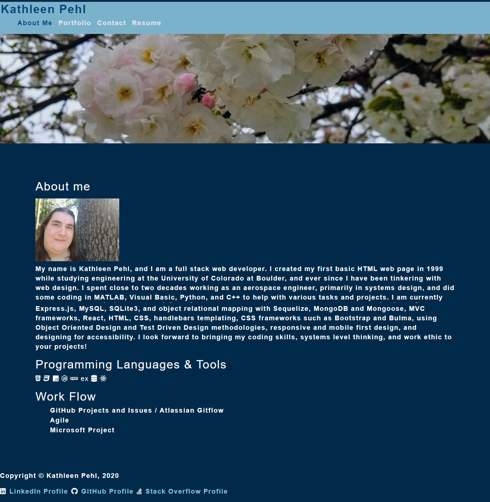

# React Portfolio

## Project Description

This project converts my portfolio from HTML and CSS (https://kpehl.github.io/) to a portfolio built with the React framework (https://kpehl.github.io/react-portfolio/)

## Tools Used

* JavaScript
* React
* HTML
* CSS
  * Bootstrap

## Deployed Application

The portfolio can be viewed at https://kpehl.github.io/react-portfolio/ 

## Notes

The contact form is not functional at this point - it only locally logs the user input.  In coming weeks, it will be turned into a functional form for people to contact me.

## Screenshot

